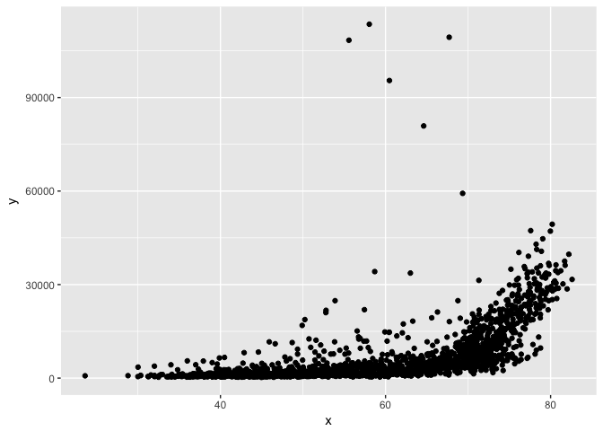

hw09 : A package to assist in the visualization of linear model results
-----------------------------------------------------------------------

The goal of hw09 is to create an easy to use package that allows users to quickly visualize the objects produced in a simple linear model, including a table of regression coefficients and p values, as well as qplot.

The gapminder data were included as a readily accessible way for the user to practice using the function.

Example
-------

This is a basic example which shows you how to solve a common problem:

``` r
library(hw09)
lmfun(gapminder$lifeExp, gapminder$gdpPercap, mydata = gapminder)
```



    #>          term    estimate std.error statistic       p.value
    #> 1 (Intercept) -19277.2490 914.09284 -21.08894  6.744507e-88
    #> 2           x    445.4447  15.01955  29.65766 3.565724e-156
